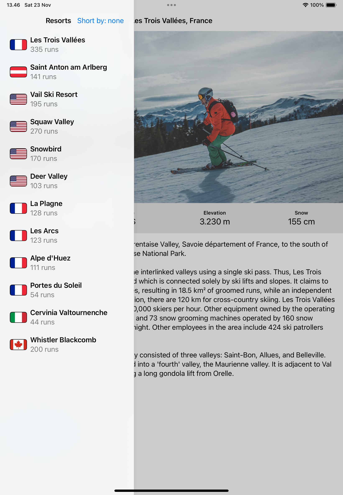

# SnowSeeker
This is a basic learning project to create an app that helps users browse ski resorts around the world. It is designed to help users find a resort suitable for their next holiday. The app showcases a list of resorts and their detailed information, optimized for both iPhone and iPad with side-by-side views for larger screens. Additionally, it explores advanced layout problem-solving, improved ways to present alerts, and more.

---  
The source learning is from the 19th project of the course "100 Days of SwiftUI" (https://www.hackingwithswift.com/100/swiftui)  

---  
## Goals  
1. Display a list of ski resorts for users to browse.  
2. Show detailed information about each resort when selected.  
3. Create a user interface optimized for iPad with side-by-side views.  
4. Solve problematic layouts to ensure smooth and intuitive navigation.  
5. Implement new ways to display sheets and alerts for an enhanced user experience.  

---
# SnowSeeker – Screenshots  
  

  
 
  
   
   
   
   
   
---  
